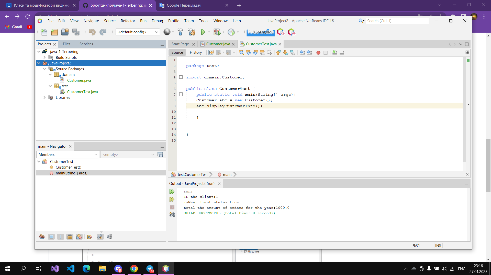
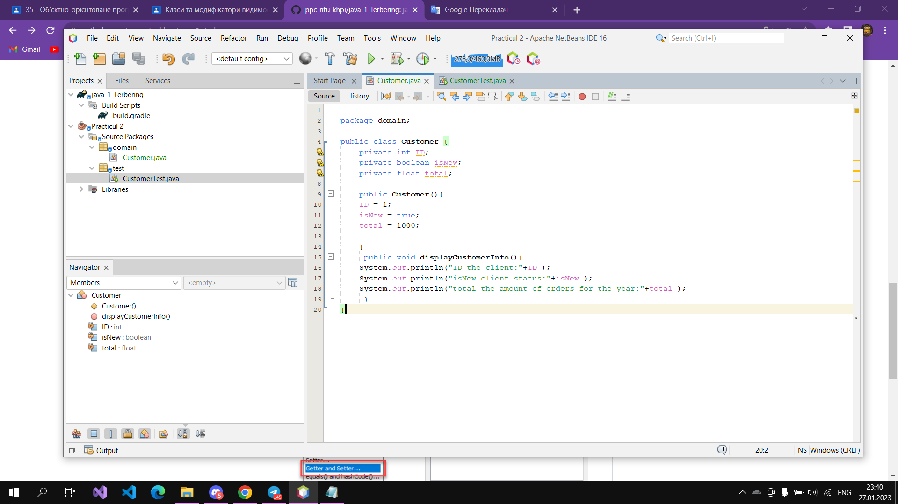

## Завдання 1. Створення класу з атрибутами

``` java

package domain;

public class Customer {
    private int ID;
    private boolean isNew;
    private float total;
    
    public Customer(){
    ID = 1;
    isNew = true;
    total = 1000;
    
    }
     public void displayCustomerInfo(){
    System.out.println("ID the client:"+ID );
    System.out.println("isNew client status:"+isNew );
    System.out.println("total the amount of orders for the year:"+total );
     }
}
```



## Завдання 2. Додавання в клас методів

## Перевірка працездатності створеного класу

``` java

package test;

import domain.Customer;
      
public class CustomerTest {
    public static void main(String[] args){
    Customer abc = new Customer();
    abc.displayCustomerInfo();
     
    }
    
    
}
```


## На 5 балів

Customer.java 

``` java
package test;

import domain.Customer;

public class CustomerTest {

    public static void main(String[] args) {
        Customer abc = new Customer();
        abc.displayCustomerInfo();
        abc.setTotal(-4.1F);
        abc.setNew(true);
        abc.setID(1);
    }

}
```


``` java
package domain;

public class Customer {

    private int ID;
    private boolean isNew;
    private float total;

    public Customer() {
        ID = 1;
        isNew = true;
        total = 1000;

    }

    public void displayCustomerInfo() {
        System.out.println("ID the client:" + ID);
        System.out.println("isNew client status:" + isNew);
        System.out.println("total the amount of orders for the year:" + total);
    }

    public void setID(int ID) {
        if (ID > 0) {
            this.ID = ID;
        }

    }

    public void setNew(boolean isNew) {
        this.isNew = isNew;

    }

    public void setTotal(float total) {
        if (total > 0) {
            this.total = total;
        }

    }
}
```


